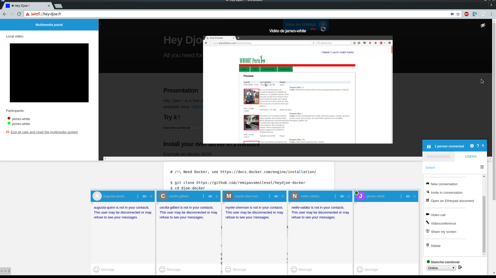

# Hey Djoe !

Instant communication system using XMPP, WebRTC and WebSockets.

## Functionnalities:
* Text chat between two or multiple users
* Collaborative editing between multiple users
* Videoconference between two or multiple users
* Screen sharing from one to another user, or to multiple users

## Working with:
* [JSXC](https://www.jsxc.org/): An XMPP client, improved to correspond to the wole system
* [Openfire](https://www.igniterealtime.org/projects/openfire/): A free XMPP server
* [RFC-5766 TURN Server](https://github.com/coturn/rfc5766-turn-server): A free server to handle media streams
* [Etherpad](http://etherpad.org/): A collaborative editing solution

Nothing would have been possible without these incredible projects !

Thanks to [webrtc-experiment.com](https://www.webrtc-experiment.com/) too.

## Screenshot

To know more check the `documentation/` folder. Project is in progress, so documentation too.
    
Docker file will be updated ASAP :)

